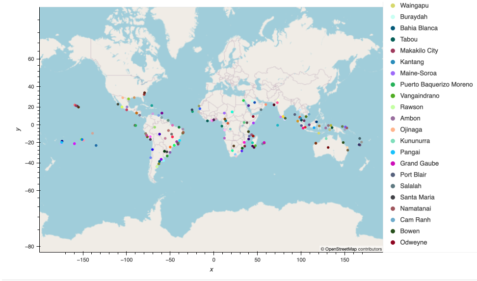
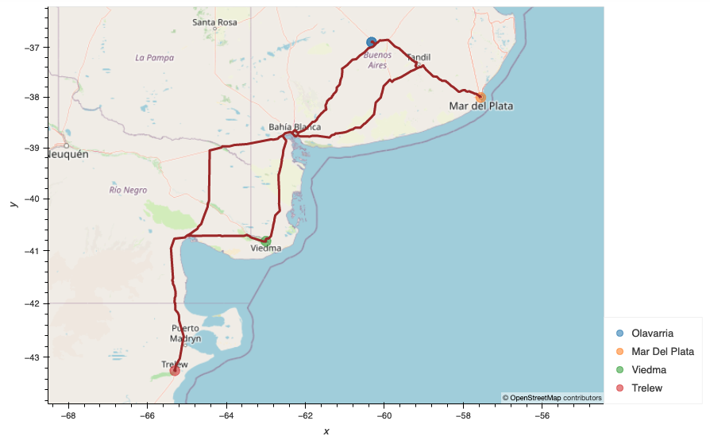

# World_Weather_Analysis

## Overview 
In this project my task was to help a travel company create a way for their customers to choose a destination based on their weather preferences for their vacation. The process entailed collecting, analyzing, and visualizing the data generated. I was able to utelize Open Weather API to collect and analyze weather data across cities worldwide. I run simulations in order to create a data frame based on input for ideal weather, then found the nearest hotel for each of those cities with the help of the Geoapify API. Then, I mocked up an itinerary of four cities in Argentina to show the effectiveness of the code.

## Resources
- DataFeames Generated: 
    - [Weather_Database/WeatherPy_Database.csv](Weather_Database/WeatherPy_Database.csv)
    - [Vacation_Search/WeatherPy_Vacation.csv](Vacation_Search/WeatherPy_Vacation.csv)
- Software: Python 3.9.6, Jupyter Notebook
- APIs:
  - Open Weather API
  - Geoapify API

## Code
- [Weather_Database/Weather_Database.ipynb](Weather_Database/Weather_Database.ipynb)
- [Vacation_Search/Vacation_Search.ipynb](Vacation_Search/Vacation_Search.ipynb)
- [Vacation_Itinerary/Vacation_Itinerary.ipynb](Vacation_Itinerary/Vacation_Itinerary.ipynb)  

## Images

### Vacation Search Map 
- [Vacation_Search/WeatherPy_vacation_map.png](Vacation_Search/WeatherPy_vacation_map.png)

### Vacation Itinerary Travel Map
- [Vacation_Itinerary/WeatherPy_travel_map.png](Vacation_Itinerary/WeatherPy_travel_map.png)

